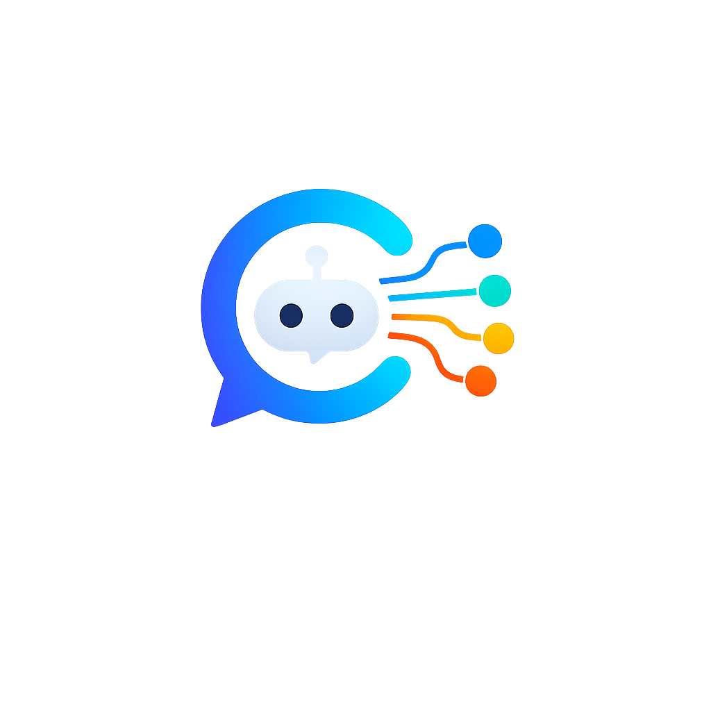

<p align="center">
    
</p>

# Crew Assistant — Chatbot multi-agente com CrewAI

Projeto de exemplo com **vários agentes CrewAI** que colaboram entre si para
responder a uma mensagem, ligados a um **chatbot em HTML/CSS/JS** com design
próprio (tema escuro, com um "relay" visual que mostra qual agente está a
trabalhar em tempo real).

## Como funciona a equipa de agentes

```
Humano
  │
  ▼
🧭 Coordenador de Atendimento   → entende o pedido e faz um plano
  │
  ▼
🔎 Pesquisador                  → reúne informação relevante
  │
  ▼
🛠️ Especialista Técnico         → aprofunda tecnicamente
  │
  ▼
✍️ Redator Final                → escreve a resposta final ao humano
  │
  ▼
Resposta mostrada no chat
```

Cada agente recebe o output dos anteriores como contexto (`context=[...]`
nas `Task` do CrewAI), pelo que o resultado final já incorpora o trabalho de
toda a equipa.

## Estrutura do projeto

crew_chatbot/
├── app.py                      # Servidor Flask (API REST + Streaming SSE)
├── crew_agents.py              # Definição dos agentes, tarefas e CrewAI
├── image_tool.py               # Geração de imagens (AUTOMATIC1111)
├── ocr_tool.py                 # OCR + criação de PDFs pesquisáveis
├── logger.py                   # Sistema de logs estruturados da Crew
├── requirements.txt
├── .env.example                # Configuração das APIs e modelos
├── README.md
│
├── logs/                       # Logs gerados por cada pedido efetuado
│   └── 20260710_183521.log
│
├── PDF/                        # PDFs gerados a partir das imagens anexadas
│   └── anexos_20260710_183522.pdf
│
├── templates/
│   └── index.html              # Interface principal do chatbot
│
└── static/
    ├── style.css               # Estilos da aplicação (Light/Dark Mode)
    ├── script.js               # Lógica do chat, SSE, OCR, idioma e temas
    │
    └── img/
        ├── logo.png            # Logótipo da aplicação
        ├── pt.svg             # Ícone do modo claro (opcional)
        └── en.svg            # Ícone do modo escuro (opcional)

## Instalação

```bash
cd crew_chatbot
python3 -m venv venv
source venv/bin/activate        # Windows: venv\Scripts\activate
pip install -r requirements.txt
cp .env.example .env
```

Edita o `.env` e escolhe **um** dos provedores:

- **OpenAI**: define `OPENAI_API_KEY` e `MODEL_NAME=gpt-4o-mini` (ou outro modelo)
- **Anthropic (Claude)**: define `ANTHROPIC_API_KEY` e `MODEL_NAME=claude-sonnet-4-6`

O CrewAI usa o `litellm` por baixo, por isso basta indicar o nome do modelo
correto e a respetiva chave de API — não é preciso alterar código.

## Executar

```bash
python app.py
```

Depois abre o browser em: **http://localhost:5000**

## Outras Funcionalidades

🌍 Internacionalização (PT/EN)

Foi implementado um sistema completo de internacionalização (i18n), permitindo alterar dinamicamente o idioma da interface e das respostas dos agentes.

- Funcionalidades
- Seleção de idioma através de um menu suspenso.
- Suporte para:
  - 🇵🇹 Português
  - 🇬🇧 English
- Alteração imediata dos textos da interface sem recarregar a página.
- Tradução dos textos estáticos da aplicação.
- O idioma escolhido é enviado para o backend, garantindo que toda a equipa de agentes responde exclusivamente no idioma selecionado.

## 🇵🇹🇬🇧 Seletor de idioma com bandeiras

- O seletor de idioma foi melhorado para incluir bandeiras, tornando a escolha mais intuitiva.

- Inclui:

- Bandeira do idioma atualmente selecionado.
- Alteração automática da bandeira quando o idioma muda.
- Ícones SVG leves e adaptados ao design da aplicação.
🌙 Tema Claro / Escuro

💬 Nova Conversa

- Foi criado um botão Nova Conversa para iniciar rapidamente uma nova sessão.

- Ao iniciar uma nova conversa:

- é criado um novo identificador de sessão;
- o histórico atual deixa de ser utilizado;
- a área do chat é limpa;
- os agentes começam uma conversa completamente nova.

📜 Histórico de Conversas

- O projeto foi preparado para apresentar o histórico das conversas anteriores.

- Cada conversa pode ser apresentada numa lista lateral, permitindo ao utilizador alternar facilmente entre diferentes sessões.

📄 Sistema de Logs

- Foi iniciado um sistema de registo da execução dos agentes.

- Os logs incluem informação como:

    - data;
    - hora;
    - pergunta do utilizador;
    - execução dos agentes;
    - resposta final.

Este sistema facilita a depuração, auditoria e análise do comportamento da Crew.

## Notas importantes

- O histórico de conversa é guardado **em memória** (dicionário Python), só
  para efeitos de demonstração. Se reiniciares o servidor, o histórico perde-se.
  Para produção, substitui por uma base de dados (SQLite, Redis, Postgres...).
- O endpoint `/api/chat/stream` usa *Server-Sent Events* para mostrar, em
  tempo real, qual agente está ativo — é isso que anima os pontos no topo
  da página (o "relay").
- Existe também um endpoint simples `/api/chat` (sem streaming) caso
  prefiras integrar noutro frontend sem lidar com SSE.
- Podes adicionar ferramentas reais aos agentes (pesquisa na web, leitura de
  ficheiros, etc.) usando `crewai-tools`, por exemplo:

  ```python
  from crewai_tools import SerperDevTool
  pesquisador = Agent(..., tools=[SerperDevTool()])
  ```

## Anexos: OCR + junção em PDF

No chat, junto ao campo de texto, existe um botão de clip (📎) que permite
anexar uma ou mais imagens (fotos de documentos, recibos, páginas de livros,
etc.). Ao enviar:

1. O backend faz **OCR** a cada imagem (com Tesseract, via `pytesseract`).
2. Junta todas as imagens num **único PDF pesquisável** (cada imagem numa
   página, com o texto OCR embutido como camada invisível — dá para
   selecionar/pesquisar texto no PDF final).
3. Guarda o PDF na pasta **`PDF/`** na raiz do projeto, com o nome
   `anexos_AAAAMMDD_HHMMSS.pdf`.
4. Se também escreveste uma mensagem de texto junto com as imagens (ex:
   "resume este documento"), o texto extraído por OCR é passado como
   contexto extra à equipa de agentes, para que a resposta final já tenha
   em conta o conteúdo das imagens.

**Pré-requisito: o motor Tesseract OCR** (não é só um pacote Python, é
software à parte):

- Windows: descarrega o instalador em
  https://github.com/UB-Mannheim/tesseract/wiki (escolhe a versão de 64-bit).
  Durante a instalação, na secção de "Additional language data", marca
  também **Portuguese** (para OCR em português).
- Depois de instalado, se o comando `tesseract` não for reconhecido no
  PowerShell, define no `.env` o caminho completo do executável:
  ```
  TESSERACT_CMD=C:\Program Files\Tesseract-OCR\tesseract.exe
  ```

Os ficheiros relevantes são `ocr_tool.py` (OCR + criação do PDF) e as
mesmas rotas de `app.py` usadas para o chat.

## Geração de imagens (opcional)

Se o pedido do humano parecer um pedido de imagem (ex: "desenha um cavalo",
"gera uma imagem de..."), o backend deteta isso automaticamente e, em vez de
acionar a crew de agentes de texto, faz o seguinte:

1. Usa o LLM já configurado (ex: `ollama/gnokit/improve-prompt`) para
   transformar o pedido num bom prompt de Stable Diffusion, em inglês.
2. Envia esse prompt para o **AUTOMATIC1111** local (`SD_API_URL` no `.env`,
   por omissão `http://127.0.0.1:7860`).
3. Devolve a imagem gerada ao chat.

**Pré-requisito:** o AUTOMATIC1111 (stable-diffusion-webui) tem de estar a
correr localmente com a flag `--api` ativa:

```
set COMMANDLINE_ARGS=--api --xformers --medvram
```

Sem isto a correr, os pedidos de texto continuam a funcionar normalmente —
só os pedidos de imagem vão falhar com uma mensagem de erro no chat.

Os ficheiros relevantes são `image_tool.py` (comunicação com a API do
AUTOMATIC1111 e refinamento do prompt) e as rotas em `app.py`.

## Personalizar

- **Agentes**: edita `crew_agents.py` (roles, goals, backstories, número de agentes).
- **Design**: edita `static/style.css` (cores em `:root`, tipografia, animações).
- **Fluxo**: podes mudar `Process.sequential` para `Process.hierarchical`
  em `crew_agents.py` se quiseres um agente "gestor" a delegar dinamicamente
  em vez de um pipeline fixo.
